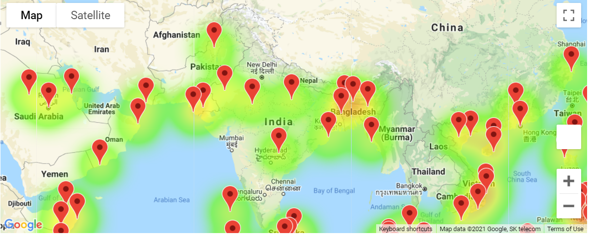

# World_Weather_Analysis

**Overview of the analysis**
     
     I am creating an anlysis for 'planmytrip app' company where they want to locate ideal weather and hotel for 2000 random latitudes and longitudes and retrive cities for those random coordinates using citipy module.

     Created inputs statements to filter preferred cities for vacation and using google maps to show weather,weather description , routes for those cities.

     I choose 4 cities and made route maps to show how we can use gmaps to find nearby hotels for preferred cities. 

     1.Used open weather api to get locations and current weather
     
     2.Used Google Maps heat layer ,places and Directions API

**Results:**

Following are the images from the analysis 

